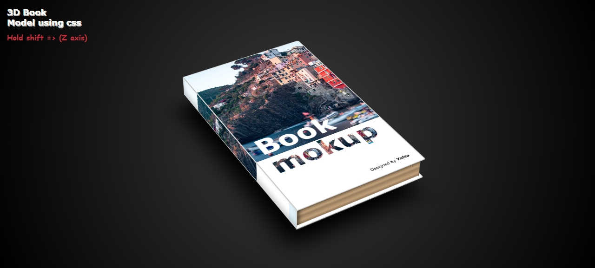

# 3D Book Powerd by CSS 

A stunning **3D book** scene built purely with **HTML**, **SCSS**, and **JavaScript**. This project demonstrates a realistic 3D effect of a book using CSS and smooth transitions to bring the scene to life.

## Features
- 3D book effect powered by CSS and SCSS
- Smooth animations and transitions
- Fully responsive and lightweight
- Custom orbit controls using only js
- Built without using WebGL or Three.js (pure CSS)

## Snapshot

## installation 
Every thing in public folder

## Tech Stack
- **HTML**
- **SCSS**
- **JavaScript**

## 📄 License
MIT License © 2024 Yahia Badr

